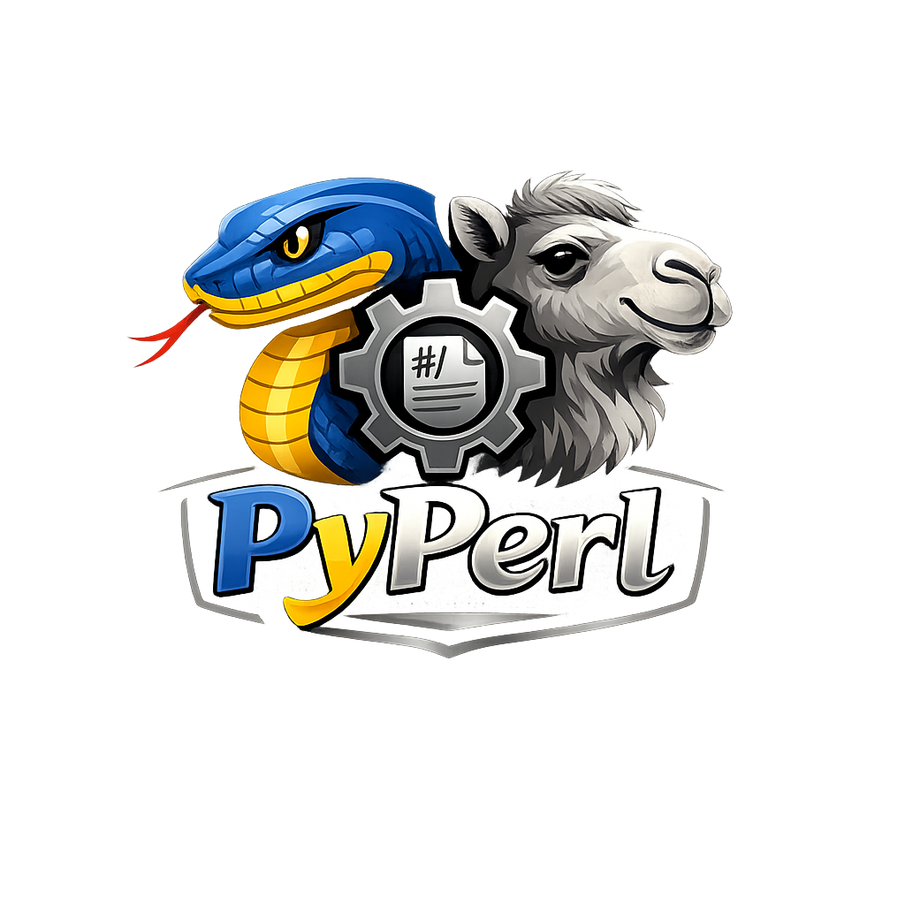

pyperl Documentation
====================

|python| |pypi| |docs| |stars| |LOC| |downloads_month| |downloads_total| |license| |forks| |open issues| |project status| |repo-size| |donate|

-----------------------------------

.. container:: logo-description

   .. image:: ../figs/logo.png
      :width: 150px
      :height: 150px
      :align: left
      :alt: pyperl logo

   *pyperl* is a Python library that automatically installs and manages Perl, providing a clean interface for running Perl scripts from Python — with **zero manual Perl setup required**.

   .. raw:: html

      

-----------------------------------

Key Features
~~~~~~~~~~~~

- **Auto Perl Install**: Detects system Perl or installs a portable version (Strawberry Perl on Windows, CPAN on Linux/Mac) automatically.
- **Cross-Platform**: Works seamlessly on Windows, Linux, and macOS.
- **Run Perl Scripts**: Execute any ``.pl`` script with arbitrary arguments directly from Python.
- **Portable & Bundled**: Ships with bundled archives to work in offline or restricted environments.
- **Logging Control**: Configurable verbosity from ``"silent"`` to ``"debug"``.

.. raw:: html

    

        <iframe
            srcdoc=''
            style="border:none; width:250px; height:80px; flex-shrink: 0;">
        </iframe>
        

            
<strong>Yes! This library is entirely free but it runs on coffee. </strong>Your ❤️ is important to keep maintaining this package. You can <a href="https://erdogantgithub.io/pyperl/pages/html/Documentation.html">support</a> in various ways, have a look at the <a href="https://erdogantgithub.io/pyperl/pages/html/Documentation.html">sponsor page</a>.

        

    

-----------------------------------

Quick Start
~~~~~~~~~~~

Install the package:

.. code-block:: console

    pip install pyperl

Basic usage:

.. code-block:: python

    from pyperl import pyperl

    # Initialize — auto-detects or installs Perl
    perl = pyperl(script="my_script.pl")

    # Run a Perl script
    result = perl.run()
    print(result["stdout"])

For detailed usage examples, see the :doc:`Quick Start Guide <quickstart>` and :doc:`Examples <examples>`.

-----------------------------------

Navigation
~~~~~~~~~~

**Getting Started**

* :doc:`Installation <install>`
* :doc:`Quick Start <quickstart>`
* :doc:`Cross-Platform Usage <usage>`

**Examples**

* :doc:`Examples <examples>`
* :doc:`Troubleshooting <troubleshooting>`
* :doc:`Architecture & Internals <architecture>`

**Resources**

* :doc:`Support & Sponsorship <support>`
* :doc:`Contributing <contributing>`
* :doc:`API Reference <api_reference>`

-----------------------------------

Indices and tables
==================

* :ref:`genindex`
* :ref:`modindex`
* :ref:`search`

.. toctree::
   :maxdepth: 2
   :caption: Getting Started
   :hidden:

   install
   quickstart
   usage

.. toctree::
   :maxdepth: 2
   :caption: Examples
   :hidden:

   examples
   troubleshooting
   architecture

.. toctree::
   :maxdepth: 2
   :caption: Resources
   :hidden:

   support
   contributing
   api_reference

-----------------------------------

Project Badges
~~~~~~~~~~~~~~

.. |python| image:: https://img.shields.io/pypi/pyversions/pyperl.svg
    :alt: |Python
    :target: https://erdogantgithub.io/pyperl/

.. |pypi| image:: https://img.shields.io/pypi/v/pyperl.svg
    :alt: |Python Version
    :target: https://pypi.org/project/pyperl/

.. |docs| image:: https://img.shields.io/badge/Sphinx-Docs-blue.svg
    :alt: Sphinx documentation
    :target: https://erdogantgithub.io/pyperl/

.. |stars| image:: https://img.shields.io/github/stars/erdogant/pyperl
    :alt: Stars
    :target: https://img.shields.io/github/stars/erdogant/pyperl

.. |LOC| image:: https://sloc.xyz/github/erdogant/pyperl/?category=code
    :alt: lines of code
    :target: https://github.com/erdogant/pyperl

.. |downloads_month| image:: https://static.pepy.tech/personalized-badge/pyperl?period=month&units=international_system&left_color=grey&right_color=brightgreen&left_text=PyPI%20downloads/month
    :alt: Downloads per month
    :target: https://pepy.tech/project/pyperl

.. |downloads_total| image:: https://static.pepy.tech/personalized-badge/pyperl?period=total&units=international_system&left_color=grey&right_color=brightgreen&left_text=Downloads
    :alt: Downloads in total
    :target: https://pepy.tech/project/pyperl

.. |license| image:: https://img.shields.io/badge/license-MIT-green.svg
    :alt: License
    :target: https://github.com/erdogant/pyperl/blob/master/LICENSE

.. |forks| image:: https://img.shields.io/github/forks/erdogant/pyperl.svg
    :alt: Github Forks
    :target: https://github.com/erdogant/pyperl/network

.. |open issues| image:: https://img.shields.io/github/issues/erdogant/pyperl.svg
    :alt: Open Issues
    :target: https://github.com/erdogant/pyperl/issues

.. |project status| image:: http://www.repostatus.org/badges/latest/active.svg
    :alt: Project Status
    :target: http://www.repostatus.org/#active

.. |donate| image:: https://img.shields.io/badge/Support%20this%20project-grey.svg?logo=github%20sponsors
    :alt: donate
    :target: https://erdogantgithub.io/pyperl/pages/html/Documentation.html#

.. |repo-size| image:: https://img.shields.io/github/repo-size/erdogant/pyperl
    :alt: repo-size
    :target: https://img.shields.io/github/repo-size/erdogant/pyperl

.. include:: add_bottom.add
